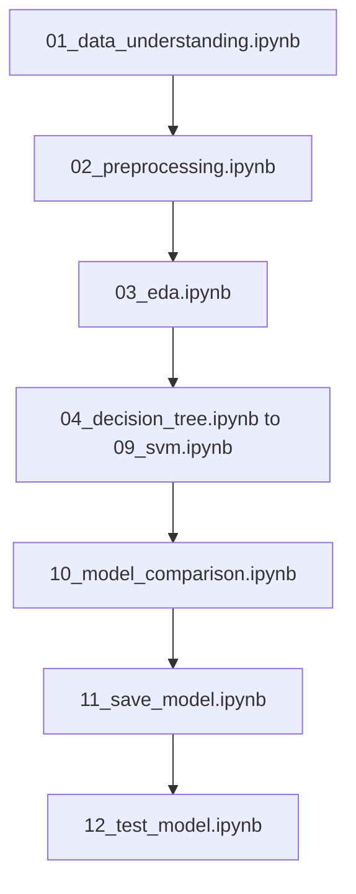
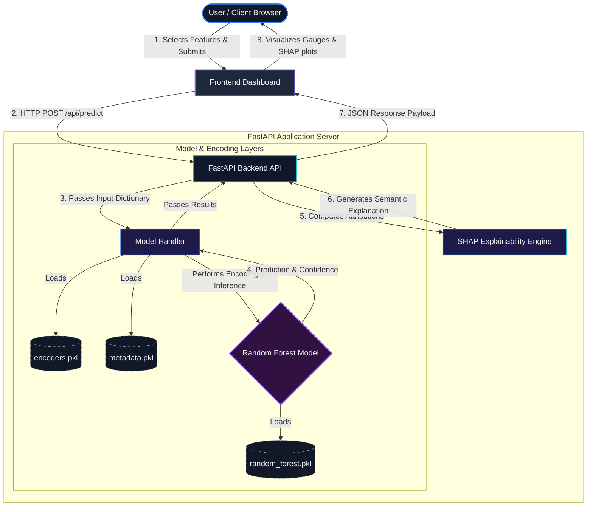
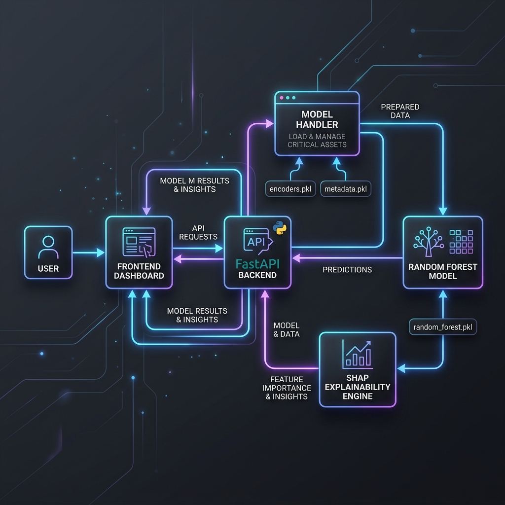
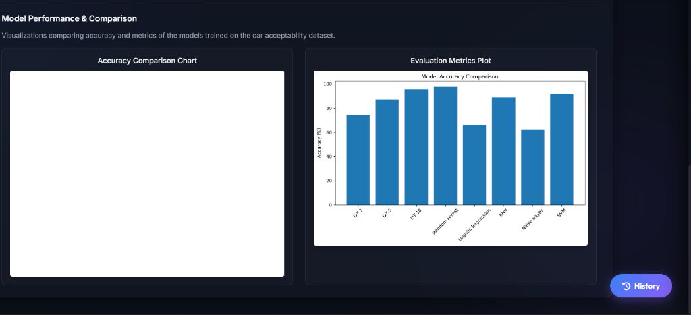

# 🚗 Car Acceptability Predictor & Explainable AI (XAI) Dashboard

[](https://www.python.org/)
[](https://fastapi.tiangolo.com/)
[](https://scikit-learn.org/)
[](https://shap.readthedocs.io/)
[](https://opensource.org/licenses/MIT)

An end-to-end Machine Learning web application designed to predict vehicle acceptability and deliver mathematical, game-theoretic explanations in real-time. Powered by a **FastAPI** backend and a **Random Forest Classifier** trained on the UCI Car Evaluation dataset, this application integrates a rich, interactive **Explainable AI (XAI) dashboard** using **SHAP (SHapley Additive exPlanations)**.

---

## 📌 Table of Contents
1. [Project Overview](#-project-overview)
2. [Features](#%EF%B8%8F-features)
3. [Technology Stack](#%EF%B8%8F-technology-stack)
4. [Machine Learning Workflow](#-machine-learning-workflow)
5. [Explainable AI (SHAP) Overview](#-explainable-ai-shap-overview)
6. [System Architecture](#-system-architecture)
7. [Model Performance Results](#-model-performance-results)
8. [Installation Instructions](#-installation-instructions)
9. [Local Development Setup](#-local-development-setup)
10. [Screenshots](#-screenshots)
11. [Future Improvements](#-future-improvements)
12. [Author Information](#-author-information)

---

## 🔍 Project Overview

In critical decision-making processes—such as leasing approval, safety classification, or purchase evaluations—predictive accuracy alone is insufficient. Stakeholders must understand the reasoning behind a model's output. 

The **Car Acceptability Predictor** solves this challenge. It trains a series of machine learning models on physical features and cost parameters of a car to categorize it as **Unacceptable**, **Acceptable**, **Good**, or **Very Good**. Crucially, it interfaces directly with **SHAP** to unpack the black-box nature of the Random Forest Classifier, showing exactly how safety ratings, seating capacity, luggage space, and cost factors influence the model's final evaluation.

---

## 🛠️ Features

* **Real-time Inference**: Instantly computes vehicle acceptability classifications based on user input.
* **Explainable AI (XAI) Dashboard**:
  * **SHAP Influence Scores**: Computes and displays the mathematical attribution of each vehicle parameter toward the prediction.
  * **Dynamic Sorting**: Separates and ranks factors into positive (supporting) and negative (opposing) influences.
  * **Semantic Natural Language Explanation**: Dynamically translates the highest-magnitude SHAP values into readable executive summaries.
* **Interactive UI/UX**:
  * Clean, dark-mode dashboard styled with **glassmorphism** principles.
  * Responsive design optimized for desktop, tablet, and mobile displays.
  * Smooth animations, hover transforms (`translateY(-2px)`), and feedback pulses.
* **Prediction History drawer**: Locally caches and manages previous evaluations for instant retrieval.
* **In-app Model Metrics**: Visualizes accuracy comparisons and validation confusion matrices.

---

## 🖥️ Technology Stack

### Backend
* **Python 3.13.5**
* **FastAPI**: Modern, high-performance web framework for API construction.
* **Uvicorn**: Asynchronous ASGI server implementation.
* **Pydantic**: Robust data validation and settings management.

### Machine Learning & XAI
* **Scikit-Learn**: Used for data pre-processing, label encoding, cross-validation, and model serialization.
* **SHAP**: Game-theoretic framework to calculate feature attributions.
* **Pandas & NumPy**: High-performance data manipulation.
* **Matplotlib & Seaborn**: Evaluation plot generation.

### Frontend
* **HTML5**: Semantic document layout.
* **CSS3**: Variables, Flexbox, CSS Grid layouts, and custom media queries.
* **JavaScript (ES6+)**: Vanilla client-side script handling AJAX requests, SVG progress gauges, and localStorage.

---

## 📈 Machine Learning Workflow

The pipeline consists of a clean, structured workflow documented across several Jupyter Notebooks:



1. **Data Preprocessing**: Handles encoding of ordinal categorical values (e.g. converting low/med/high parameters to integer keys) and saves LabelEncoders to serialize data transformations.
2. **Exploratory Data Analysis (EDA)**: Inspects distributions, class imbalances, and correlations.
3. **Algorithm Benchmarking**: Trains and tunes 8 model variations (Decision Trees, Support Vector Machines, k-Nearest Neighbors, Logistic Regression, Naive Bayes, and Random Forests).
4. **Production Pipeline**: Serializes the best-performing model (Random Forest), LabelEncoders, and training metadata to disk.

---

## 🧠 Explainable AI (SHAP) Overview

This application adheres strictly to scientific Explainable AI (XAI) standards:

### Game-Theoretic Attributions
Under the additive property of Shapley values, the sum of the feature attributions plus the model's base expected value equals the predicted probability for the active class:

$$\sum_{j=1}^{M} \phi_j(x) + E[f(x)] = f(x)$$

Where:
* $\phi_j(x)$ represents the SHAP value (attribution score) for feature $j$.
* $E[f(x)]$ is the expected baseline probability (the class frequency in the training set).
* $f(x)$ is the final probability output of the model.

### Rigorous Metrics Presentation
SHAP values are calculated as marginal contributions in probability space (ranging from $-1.0$ to $+1.0$). To avoid misleading users, they are **never converted to percentages** or presented as standalone probabilities. Instead, they are represented as **Influence Scores**, **Impact Scores**, or **Contribution Strengths**, indicating how much a feature pushed the model towards or away from a classification.

---

## ⚙️ System Architecture

The following interactive Mermaid diagram illustrates the client-server request loop, data encoding pipeline, and Explainable AI computation flow:



### Visual System Map
For a high-level visual representation of the architecture and data dependencies:


*Figure 5: High-level system architecture layout showing data dependencies and flow integrations.*


---

## 📊 Model Performance Results

During the model selection phase, Random Forest outperformed other models by a significant margin on the test split:

| Model / Classifier | Accuracy (%) |
| :--- | :---: |
| **Random Forest (Selected for Production)** | **97.40%** |
| Decision Tree (Max Depth = 10) | 95.38% |
| Support Vector Machine (SVM) | 91.33% |
| k-Nearest Neighbors (KNN) | 88.73% |
| Decision Tree (Max Depth = 5) | 86.99% |
| Decision Tree (Max Depth = 3) | 74.28% |
| Logistic Regression | 65.90% |
| Naive Bayes | 62.43% |

---

## 📦 Installation Instructions

### Prerequisites
* Python 3.9+ installed on your system.

### 1. Clone the Repository
```bash
git clone https://github.com/DunminiRathnayake/Car_Acceptability_Project.git
cd Car_Acceptability_Project
```

### 2. Set Up Virtual Environment (Recommended)
```bash
python -m venv venv
# On Windows
venv\Scripts\activate
# On MacOS/Linux
source venv/bin/activate
```

### 3. Install Dependencies
```bash
pip install -r backend/requirements.txt
```

---

## 🚀 Local Development Setup

### Running the Web Server
Launch the development server using the Windows batch helper:
```bash
start.bat
```
Or run uvicorn manually in the shell:
```bash
python -m uvicorn backend.app:app --reload --host 127.0.0.1 --port 8000
```
Visit the local dashboard: [http://127.0.0.1:8000](http://127.0.0.1:8000)

### Running Automated Integration Tests
Verify the backend prediction logic, Pydantic inputs, and SHAP output formats by running the test suite:
```bash
python backend/test_api.py
```

### Regenerating Performance Plots
To update the visual plots in the dashboard assets:
```bash
python scripts/generate_plots.py
```

---

## 📸 Screenshots

Here are snapshots of the application interface:

#### 1. Dashboard Overview

*Figure 1: The unified dashboard interface displaying inputs, predictions, and model details.*

#### 2. SHAP Explainability Visualization

*Figure 2: Real-time SHAP analysis separating positive (supporting) and negative (opposing) feature impacts.*

#### 3. Feature Importance Distribution

*Figure 3: Global feature importances computed by the Random Forest classifier during training.*

#### 4. Model Accuracy Comparison

*Figure 4: Validation accuracy benchmarks comparing the production Random Forest model with alternative classifiers.*

---

## 🔮 Future Improvements

* **Alternative Explainers**: Integrate LIME (Local Interpretable Model-agnostic Explanations) alongside SHAP for comparison.
* **Hyperparameter Tuning Notebook**: Implement automated grid searches or Optuna trials directly in training scripts.
* **Docker Packaging**: Containerize backend and static frontend code for seamless multi-environment deployments.
* **Inference Caching**: Add Redis caching to quickly serve explanations for frequently evaluated vehicle configurations.

---

## ✍️ Author Information

* **Developer**: Dunmini Rathnayake
* **GitHub**: [@DunminiRathnayake](https://github.com/DunminiRathnayake)
* **Project Repository**: [Car Acceptability Project](https://github.com/DunminiRathnayake/Car_Acceptability_Project)
